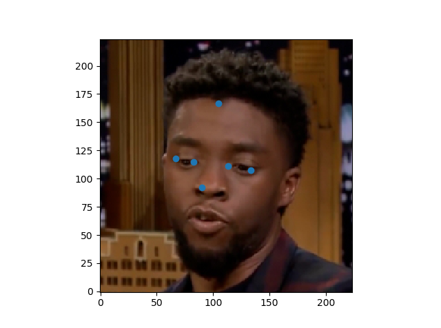

# Deep Auto Tracking Points.
From working in the VFX industry I wanted to created a model that can automatically place tracking points for us in a match move.
## Results

</>

## Dataset
I used a dataset of 100 images (quite small for a dataset,) but it seemed to perform the concept.
For the trainSet I used 90 images, and the rest for inference. 

## Packages that needs to be installed:
There's a few packages one needs to install to get my **Network** to work.
* numpy
* pytorch
* cv2
* matplotlib
## How to use the model
In order to run my model go into the model.py and run. 
This should bring in a prediction image, and visualize it for you.

# Conclusion
The model seems to run well, but I would like to expand the dataSet a little more with crops, rotations, and expand the scale a lot more.