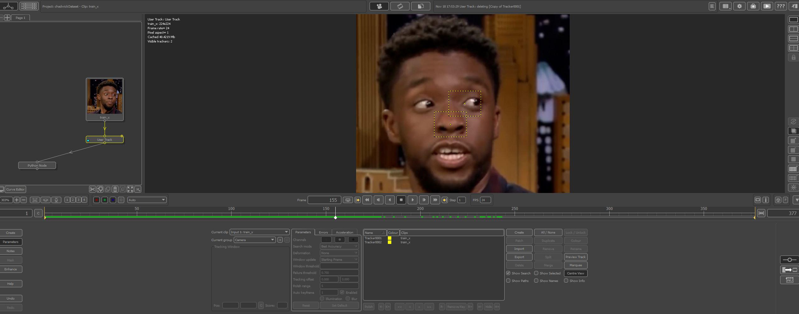

# VFX Facial Landmark Detection.

This App places predicts 2d tracking points on the face to be exported into VFX tracking package.

Pre-requisites
--------------

* numpy
* pytorch
* cv2
* matplotlib22.1.1

Getting Started
---------------

In order to run the model go into the train.py and run
~~~
pred, losses, epochs_l = train(images, labels, 50)
~~~
It will return a prediction, error amount, and a list of epochs.

for inference with a new image run the predict function.

~~~
predict('path_to_image')
~~~

Results
-------

The model seems to run well, but I would like to expand the dataSet a little more with crops, rotations, and expand the scale a lot more.

